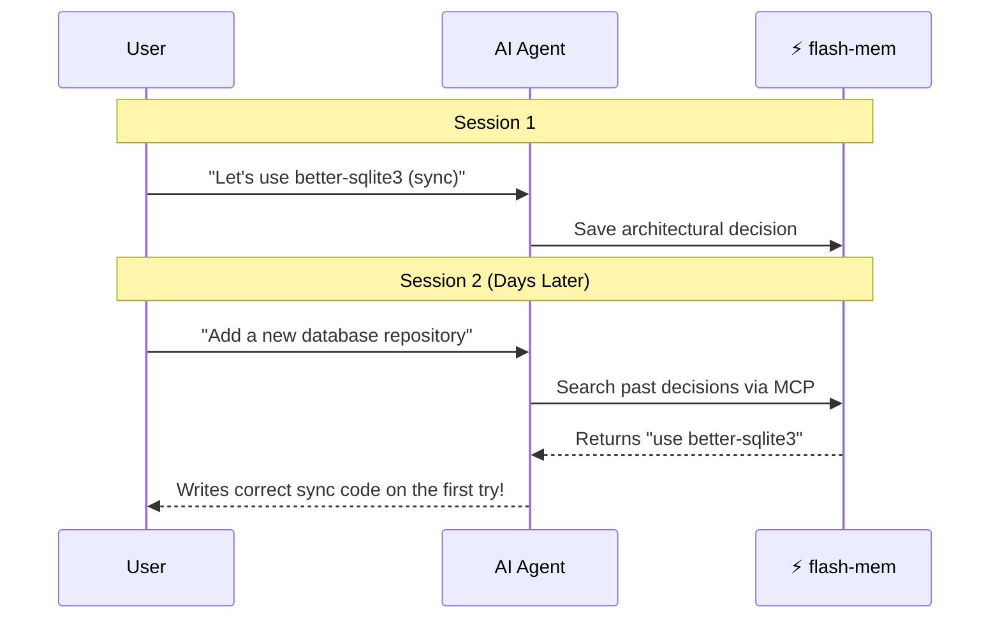

# ⚡ flash-mem

[](https://www.npmjs.com/package/flash-mem)
[](https://opensource.org/licenses/MIT)
[](https://smithery.ai/server/flash-mem)
[](https://github.com/DyanGalih/flash-mem)

**Give your AI coding assistant a permanent memory.**

`flash-mem` is an MCP (Model Context Protocol) server and CLI tool designed to provide durable engineering memory for any MCP-compatible AI agent, such as Claude Code, Cursor, Windsurf, and Roo Code. For agent-assisted use, MCP is the primary integration path: connect the workspace first so the agent can read project memory before it starts making changes.

The retrieval-first workflow is intentionally token-conscious: summary and search tools are designed to return compact context so the agent can reuse durable knowledge without pulling unnecessary history into the prompt.

Constantly reminding your AI about the same architectural rules? Tired of watching it stumble over known edge cases? Traditional static prompts like `.cursorrules` or `CLAUDE.md` quickly become outdated and simply can't scale with a complex project's history. 

`flash-mem` solves this by acting as a living knowledge base. It persistently stores your project's high-level summaries, core architectural decisions, coding conventions, and historical bug fixes. When your agent begins a new task, it dynamically retrieves the specific context it needs through the Model Context Protocol, ensuring it understands your codebase's unwritten rules before writing any code.

**How it works (The Flow):**


*No re-explaining. No copy-pasting. The agent just **knows**.*

## ✨ Why Use It?

`flash-mem` is a memory layer for engineering work, not a source-code mirror.

It is designed to help engineers and AI agents:
- remember durable project knowledge across sessions
- search architecture decisions and conventions quickly
- reduce repeated research and repeated mistakes
- keep retrieval-first workflows before code changes
- preserve context for agent-assisted development and SDD

If you are using AI for **vibe coding**, **spec-driven development** (like using **Spec-Kit**), or as a pair-programming partner, `flash-mem` helps keep the model grounded in your actual codebase instead of guessing from scratch every session.

Recent updates also expanded the MCP surface with compact response formatting and compatibility helpers, which makes memory retrieval cheaper to read and easier to reuse in longer sessions.

For a deeper explanation of greenfield and brownfield workflows, see [Usage Guide](docs/usage.md).

For setup, workflow, and migration details, see the linked docs.

For a reusable review prompt to check whether flash-mem was used in a task, see [flash-mem Review Prompt](docs/flash-mem-review-prompt.md).

For lightweight release notes, see [Release Notes](docs/releases.md).

## 🚀 Quick Start

1. Initialize the workspace:
```bash
flash-mem init .
```
2. Connect your IDE or agent through MCP so the agent can retrieve project memory before writing code.
3. For brownfield work, refresh the markdown-backed project memory:
```bash
flash-mem rebuild-index . --yes
```

Important:

- Run `flash-mem init .` inside each project root so each repository gets its own `.flash-mem` store.
- `flash-mem init .` also scaffolds the project-local agent-instruction files and MCP config bundle.
- The `flash-mem` MCP server is **stateless**. It can be configured once globally in your IDE (e.g. Antigravity, Cursor, Roo Code). You do **not** need to configure a separate MCP server per project.
- Every MCP tool call now requires a `project_path` parameter. This allows the single global MCP server to seamlessly manage memory for multiple active projects simultaneously.
- After running `flash-mem init .` or changing the global MCP configuration, reload your IDE if necessary so the MCP client picks up the new tools.

## 📦 Installation

### Global Installation
```bash
npm install -g flash-mem
```

### Development Setup (from source)
1. Clone the repository and install dependencies:
```bash
git clone https://github.com/DyanGalih/flash-mem.git
cd flash-mem
npm install
```

2. Build the project:
```bash
npm run build
```

3. Link the package globally for development:
```bash
npm link
```

## 🔌 MCP Configuration

`flash-mem` is fully compatible with standard Model Context Protocol (MCP) clients, and MCP is the expected way for an agent to use the full flash-mem toolset. See [docs/mcp-setup.md](docs/mcp-setup.md) for grouped setup examples covering global installation, development checkouts, direct path execution, and IDE-specific configurations. The CLI remains available for manual, debugging, and legacy workflows, but agent-assisted usage should be wired through MCP first.

Antigravity and Global MCP note:

- Since all tools now require a `project_path`, you no longer need to create a separate MCP server configuration for each repository.
- You can simply set up a single global MCP server in your IDE (e.g. Antigravity Editor, Cursor, Roo Code) and it will correctly route memory operations to the appropriate project based on the context.

Recommended pattern (Global Configuration):

```json
{
  "mcpServers": {
    "flash-mem": {
      "command": "flash-mem",
      "args": ["mcp"],
      "env": {
      }
    }
  }
}
```

For the CLI, put the equivalent config in `.agents/mcp_config.json` inside each repository and set `cwd` to `.` if you want the server to follow that repo automatically.

## 📄 License

This project is licensed under the MIT License - see the [LICENSE](LICENSE) file for details.
